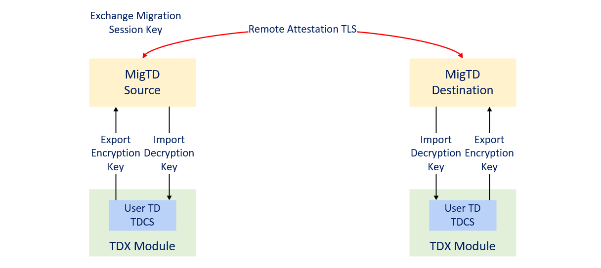

# rust-migtd

A rust version Migration TD.

Migration TD (MigTD) is used to evaluate potential migration sources and targets for adherence to the TD Migration Policy, then securely transfer a Migration Session Key from the source platform to the destination platform to migrate assets of a specific TD.



The specification of MigTD is at [Intel TDX Migration TD Design Guide](https://cdrdv2.intel.com/v1/dl/getContent/733580)

The full TD Migration architecture and flow is discussed in [TD Migration Architecture Specification](https://cdrdv2.intel.com/v1/dl/getContent/733578).

## Known limitation
This package is only the sample code to show the concept. It does not have a full validation such as robustness functional test and fuzzing test. It does not meet the production quality yet. Any codes including the API definition, the libary and the drivers are subject to change.

## How to build

### Prerequisites
1. Rust toolchain

* Install [Rust](https://www.rust-lang.org/tools/install):
```
curl --proto '=https' --tlsv1.2 -sSf https://sh.rustup.rs | sh
```
* Install toolchain and components required by MigTD:
```
rustup toolchain install nightly-2023-08-28
rustup component add --toolchain nightly-2023-08-28 rust-src
cargo install cargo-xbuild
```

2. [clang](https://releases.llvm.org/download.html#13.0.1)

3. [NASM](https://www.nasm.us/)

* Please make sure `clang`, `llvm-ar` and `nasm` are installed and can be found in your PATH

4. [Attestation Library Prerequisites](https://github.com/intel/SGXDataCenterAttestationPrimitives/tree/tdx_1.5_dcap_mvp_23q1/QuoteGeneration/quote_wrapper/td_migration#prerequisites)

* Ensure that you have the following required operation systems: 
  * Red Hat Enterprise Linux Server release 8.5 64bits
  * CentOS Stream 8 64bit
  * Ubuntu* 22.04 LTS Server 64bits
* Use the following commands to install the required tools:
  *  On Red Hat Enterprise Linux 8.5
  ```
    sudo yum groupinstall 'Development Tools'
    sudo yum install ocaml ocaml-ocamlbuild wget rpm-build pkgconf libtool
  ```
  *  On CentOS Stream 8
  ```
    sudo dnf group install 'Development Tools'
    sudo dnf --enablerepo=powertools install ocaml ocaml-ocamlbuild wget rpm-build pkgconf libtool
  ```
  *  On CentOS Stream 9
  ```
    sudo dnf group install 'Development Tools'
    sudo dnf install ocaml ocaml-ocamlbuild wget rpm-build pkgconf perl-FindBin libtool
  ```
  * On Ubuntu 22.04
  ```
    sudo apt-get install build-essential ocaml ocamlbuild wget pkgconf libtool
  ```

### Download Source Code

```
git clone https://github.com/intel/MigTD.git
git submodule update --init --recursive
```

### Before build

```
./sh_script/preparation.sh
```

### Build Migration TD

To build a MigTD binary with a default migration policy:
```
cargo image
```

By default, MigTD uses the attestation root certificate at `config/intel_root_sbx.der` and
migration policy at `config/policy.json`

To specify the root certificate to be enrolled, you can use the `--root-ca` argument:
```
cargo image --root-ca /path/to/cert
```
Note: SGX SBX Root CA can be downloaded at https://sbx-certificates.trustedservices.intel.com/Intel_SGX_Provisioning_Certification_RootCA.cer

To specify the policy file to be enrolled, you can use the `--policy` argument:
```
cargo image --policy /path/to/policy
```

To use virtio-serial instead of virtio-vsock for the guest-host communication:
```
cargo image --no-default-features --features remote-attestation,stack-guard,virtio-serial
```

### Generate SERVTD_INFO_HASH

To generate the SERVTD_HASH_INFO of a MigTD binary with a default TD configuration at `config/servtd_info.json`:
```
cargo hash --image /path/to/migtd.bin
```
The output of hash digest is `./migtd.servtd_info_hash` by default.

You can also specify a custom configuration in the same format with `config/servtd_info.json`
```
cargo hash --image /path/to/migtd.bin --servtd-info /path/to/servtd_info.json
```

## How to run

### Prerequisites

1. Linux Kernel (KVM) and QEMU with with TDX 1.5 support

* [qemu-kvm-configuration](doc/qemu_kvm_configuration.md) lists the versions of dependencies that MigTD has been tested on. Also refer to [tdx-tools](https://github.com/intel/tdx-tools/releases/tag/2023ww15) for more information about MVP release.

2. TDX Attestation Software Stack

* MigTD depends on `sgx-dcap-pccs` and `tdx-qgs` to do remote attestation. Please refer to [linux-sgx](https://github.com/intel/linux-sgx/tree/tdx_1.5_mvp_23q1) for details or follow the [tdx-tools wiki](https://github.com/intel/tdx-tools/wiki/5.-TDX-End-to-End-Attestation) to setup the environment.

3. Guest-Hypervisor Communication Interface (GHCI) required for remote attestation

* MigTD relies on `TDG.VP.VMCALL<GetQuote>` and `TDG.VP.VMCALL<SetupEventNotifyInterrupt>` interfaces provided by hypervisor to get quote. Please make sure your hypervisor implements these leaves.

### Steps to run pre-migration

#### Virtio-vsock approach

1. Start two vsock server agent on host:

```
socat TCP4-LISTEN:9001,reuseaddr VSOCK-LISTEN:1234,fork &
socat TCP4-CONNECT:127.0.0.1:9001,reuseaddr VSOCK-LISTEN:1235,fork &
```

2. Launch source Migration TD:

```
QEMU=/path/to/qemu-system-x86_64
MIGTD=/path/to/migtd.bin

$QEMU -accel kvm \
-M q35 \
-cpu host,host-phys-bits,-kvm-steal-time,pmu=off \
-smp 1,threads=1,sockets=1 \
-m 32M \
-object tdx-guest,id=tdx0,sept-ve-disable=off,debug=off,quote-generation-service=vsock:1:4050 \
-object memory-backend-memfd-private,id=ram1,size=32M \
-machine q35,memory-backend=ram1,confidential-guest-support=tdx0,kernel_irqchip=split \
-bios ${MIGTD} \
-device vhost-vsock-pci,id=vhost-vsock-pci1,guest-cid=18,disable-legacy=on \
-name migtd-src,process=migtd-src,debug-threads=on \
-no-hpet \
-nographic -vga none -nic none \
-serial mon:stdio
```

3. Launch destination Migration TD:

```
QEMU=/path/to/qemu-system-x86_64
MIGTD=/path/to/migtd.bin

$QEMU -accel kvm \
-M q35 \
-cpu host,host-phys-bits,-kvm-steal-time,pmu=off \
-smp 1,threads=1,sockets=1 \
-m 32M \
-object tdx-guest,id=tdx0,sept-ve-disable=off,debug=off,quote-generation-service=vsock:1:4050 \
-object memory-backend-memfd-private,id=ram1,size=32M \
-machine q35,memory-backend=ram1,confidential-guest-support=tdx0,kernel_irqchip=split \
-bios ${MIGTD} \
-device vhost-vsock-pci,id=vhost-vsock-pci1,guest-cid=36,disable-legacy=on \
-name migtd-dst,process=migtd-dst,debug-threads=on \
-no-hpet \
-nographic -vga none -nic none \
-serial mon:stdio
```

3. Do pre-migration:

```
# Asking migtd-src to connect to the src socat
echo "qom-set /objects/tdx0/ vsockport 1234" | nc -U /tmp/qmp-sock-src

# Asking migtd-dst to connect to the dst socat
echo "qom-set /objects/tdx0/ vsockport 1235" | nc -U /tmp/qmp-sock-dst
```
Note: user TDs need to be bound to MigTDs before pre-migration.

#### Virtio-serial approach [experimental feature]

1. Launch destination Migration TD:

```
QEMU=/path/to/qemu-system-x86_64
MIGTD=/path/to/migtd.bin

$QEMU -accel kvm \
-M q35 \
-cpu host,host-phys-bits,-kvm-steal-time,pmu=off \
-smp 1,threads=1,sockets=1 \
-m 32M \
-object tdx-guest,id=tdx0,sept-ve-disable=off,debug=off,quote-generation-service=vsock:1:4050 \
-object memory-backend-memfd-private,id=ram1,size=32M \
-machine q35,memory-backend=ram1,confidential-guest-support=tdx0,kernel_irqchip=split \
-bios ${MIGTD} \
-device virtio-serial-pci,id=virtio-serial0 \
-chardev socket,host=127.0.0.1,port=1234,server=on,id=foo \
-device virtserialport,chardev=foo,bus=virtio-serial0.0 \
-name migtd-dst,process=migtd-dst,debug-threads=on \
-no-hpet \
-nographic -vga none -nic none \
-serial mon:stdio
```

2. Launch source Migration TD:

```
QEMU=/path/to/qemu-system-x86_64
MIGTD=/path/to/migtd.bin

$QEMU -accel kvm \
-M q35 \
-cpu host,host-phys-bits,-kvm-steal-time,pmu=off \
-smp 1,threads=1,sockets=1 \
-m 32M \
-object tdx-guest,id=tdx0,sept-ve-disable=off,debug=off,quote-generation-service=vsock:1:4050 \
-object memory-backend-memfd-private,id=ram1,size=32M \
-machine q35,memory-backend=ram1,confidential-guest-support=tdx0,kernel_irqchip=split \
-bios ${MIGTD} \
-device virtio-serial-pci,id=virtio-serial0 \
-chardev socket,host=127.0.0.1,port=1234,server=off,id=foo \
-device virtserialport,chardev=foo,bus=virtio-serial0.0 \
-name migtd-src,process=migtd-src,debug-threads=on \
-no-hpet \
-nographic -vga none -nic none \
-serial mon:stdio
```

Replace the IP specified by `host=127.0.0.1` with the target IP address, if cross host migration is required.

3. Do pre-migration:

Here we still set the `vsockport` as a workaround to trigger the pre-migration:

```
# Asking migtd-src to start pre-migration
echo "qom-set /objects/tdx0/ vsockport 0" | nc -U /tmp/qmp-sock-src

# Asking migtd-dst to start pre-migration
echo "qom-set /objects/tdx0/ vsockport 0" | nc -U /tmp/qmp-sock-dst
```